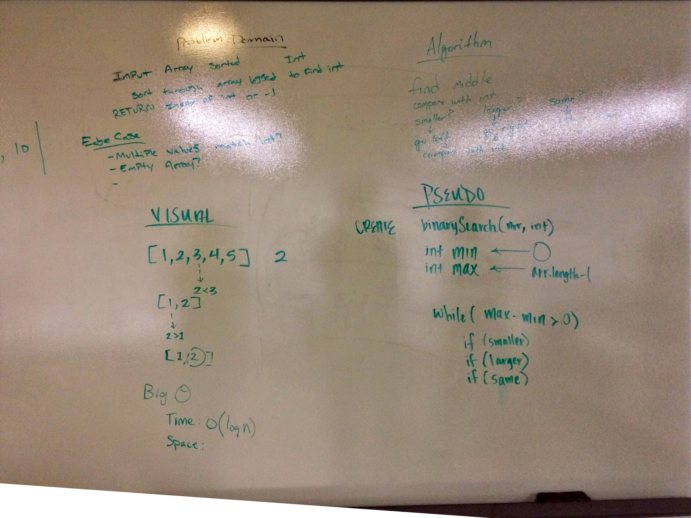
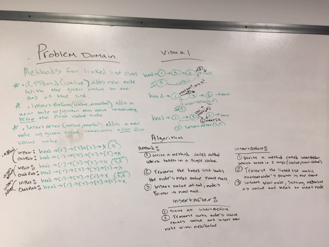
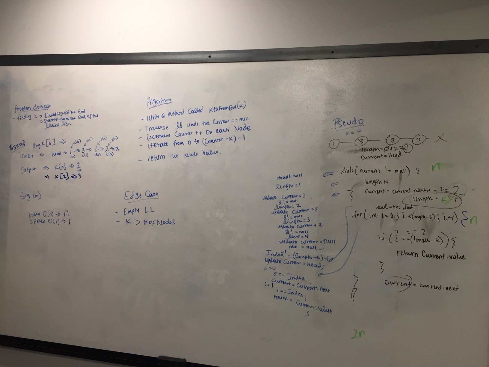
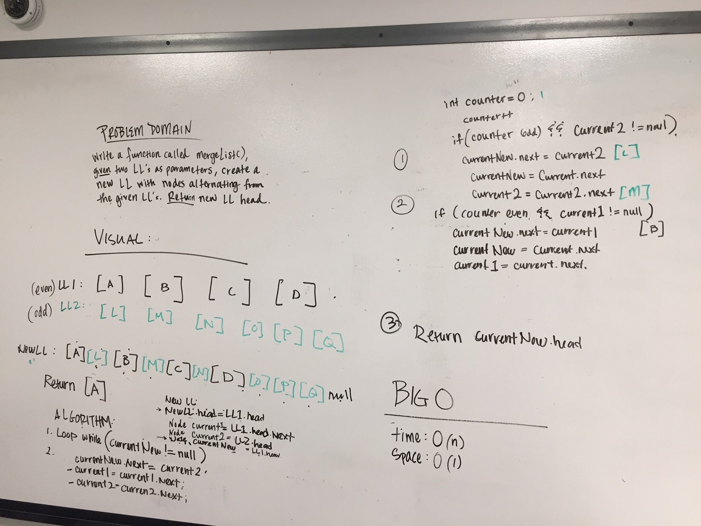
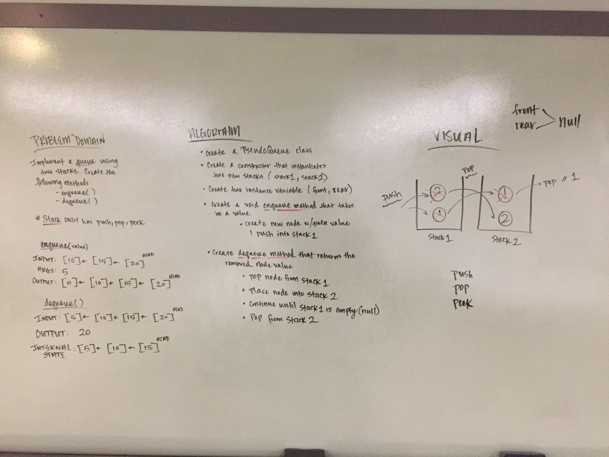
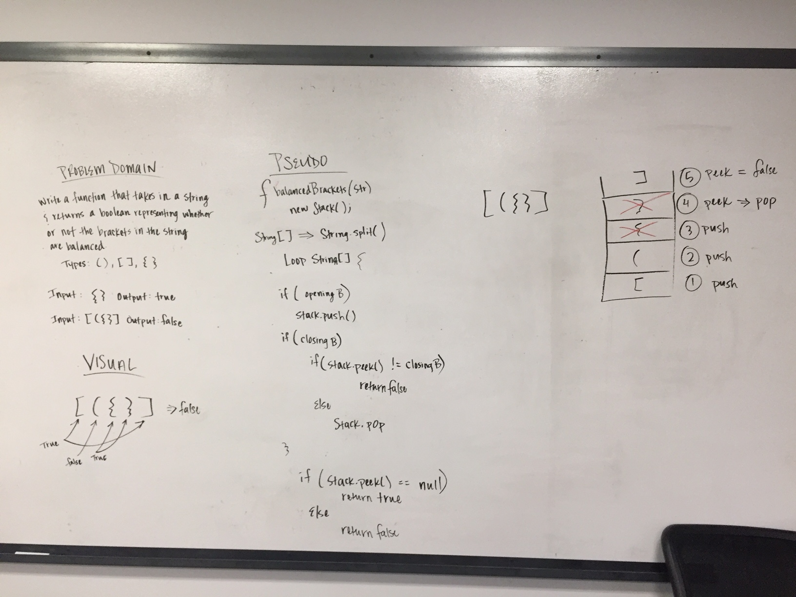
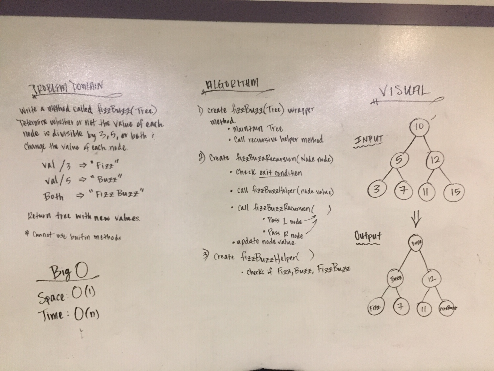
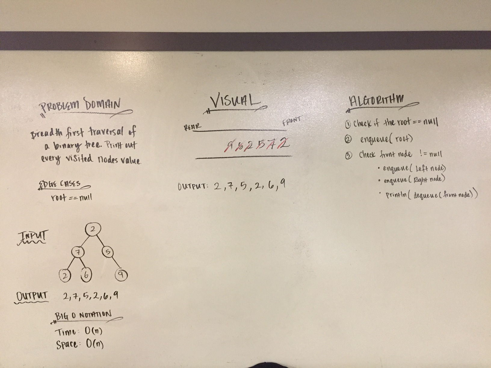
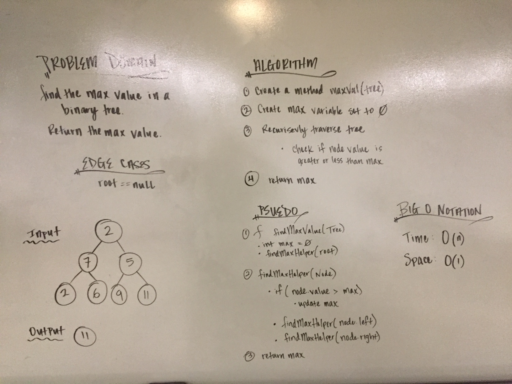
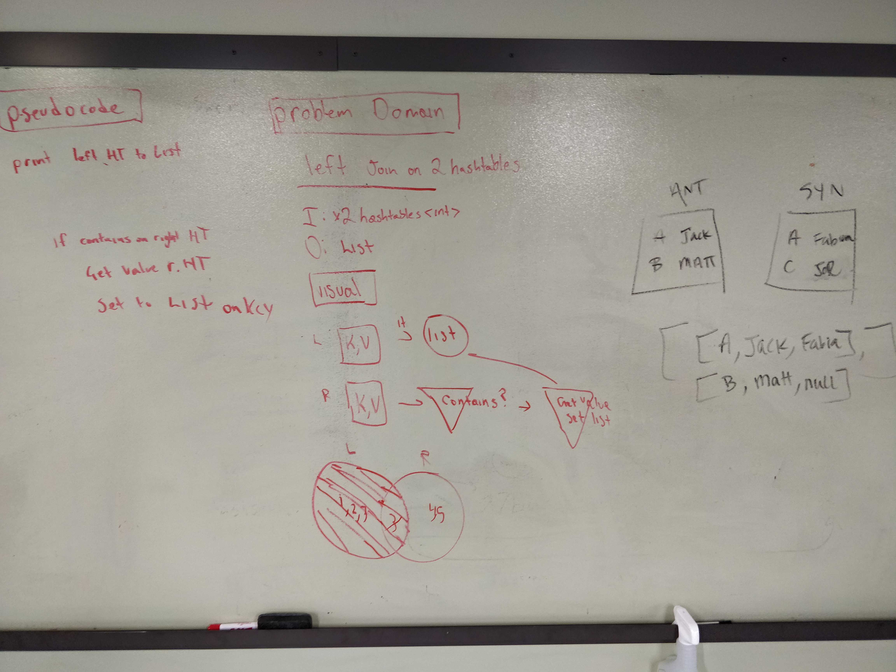

# code401challenge

## Table of Contents
1. Reverse an Array
2. Insert and shift an array in middle at index
3. Binary search in a sorted 1D array
4. Linked List Implementation
5. Linked list insertions
6. Stacks and queues
7. Animal Shelter
8. Multi-bracket Validation
9. Binary Tree and BST Implementation
10. Breadth-first Traversal
11. Find the Maximum Value in a Binary Tree
12. FizzBuzz binary tree
13. Breadth-first Traversal
14. Find the Maximum Value in a Binary Tree
15. Hashtable
16. Find the first repeated word in a book
17. Find common values in 2 binary trees
18. Implement a simplified LEFT JOIN for 2 Hashmaps
19. Implement a Graph
20. Implement a breadth-first traversal on a graph
21. Direct flights

--------------------------------------------------------------

### 1. Reverse an Array

#### Challenge
Write a function called reverseArray which takes an array as an argument. Without utilizing any of the built-in methods available to your language, return an array with elements in reversed order.

#### Approach & Efficiency
The approach we took was to iterate through the array and during each iteration we would populate a new array with the correct reversed value.

```
newArray[i] = array[(array.length - 1) - i]
```

0(n) - linear runtime

### Code
[Github](https://github.com/mattstuhring/data-structures-and-algorithms/blob/master/code401challenges/src/main/java/code401challenges/ArrayReverse.java)

### Contributions
- Sapana Poudel

#### Solution


--------------------------------------------------------------

### 2. Insert and shift an array in middle at index

#### Challenge
Write a function called insertShiftArray which takes in an array and the value to be added. Without utilizing any of the built-in methods available to your language, return an array with the new value added at the middle index.

#### Approach & Efficiency
The approach we took was iterating through the given array, assigning the value into our new array, and while doing that we kept track of the index with an outside counter variable.  This allowed us to increment the counter variable once we reached our midpoint without effecting our iterating through the given array.

Big O Notation
Time: O(n)
Space: O(n)

### Code
[Github](https://github.com/mattstuhring/data-structures-and-algorithms/blob/master/code401challenges/src/main/java/code401challenges/ArrayShift.java)

### Contributions
- Jack Kinne
- Manish KC

#### Solution


--------------------------------------------------------------

### 3. Binary search in a sorted 1D array

#### Challenge
Write a function called BinarySearch which takes in 2 parameters: a sorted array and the search key. Without utilizing any of the built-in methods available to your language, return the index of the array’s element that is equal to the search key, or -1 if the element does not exist.

#### Approach & Efficiency
As long as min is less than or equal to max a while loop will continue to check if the key is larger, smaller, or the same.  If the element does not exist the method will return -1;

Big O Notation
Time: O(log(n))
Space: O(1)

### Code
[Github](https://github.com/mattstuhring/data-structures-and-algorithms/blob/master/code401challenges/src/main/java/code401challenges/BinarySearch.java)

### Contributions
- Jack Kinne
- Brandon Hurrington
- Marisha Hoza
- Chris Coulon

#### Solution


--------------------------------------------------------------

### 3. Linked List Implementation

#### Challenge
Implement a Singly Linked List Data Structure

#### Approach & Efficiency
Create a Node class that has properties for the value stored in the Node, and a pointer to the next Node.  Within your LinkedList class, include a head property. Upon instantiation, an empty Linked List should be created.

Big O Notation
Time: O(n)
Space: O(1)

### Code
[Github](https://github.com/mattstuhring/data-structures-and-algorithms/blob/master/code401challenges/src/main/java/linkedList/LinkedList.java)

### Contributions
- Jack Kinne
- Melfi Perez
- Nic Paro
- Travis Cox

#### Solution
N/A

--------------------------------------------------------------

### 4. Linked list insertions

#### Challenge
Write 3 insertion methods for a singly linked list.

#### Approach & Efficiency
Continue working off of the already built LinkedList & Node class.  Implement 3 insertion methods to append a node at the end, insert before a node, and insert after a node.

Big O Notation
Time: O(n)
Space: O(1)

### Code
[Github](https://github.com/mattstuhring/data-structures-and-algorithms/blob/master/code401challenges/src/main/java/linkedList/LinkedList.java)

### Contributions
- Renee Messick

#### Solution


--------------------------------------------------------------

### 5. k-th value from the end of a linked list

#### Challenge
Write a method for the Linked List class which takes a number, k, as a parameter. Return the node’s value that is k from the end of the linked list. 

#### Approach & Efficiency
Traverse the entire linked list while keeping track of the length.  Iterate from 0 to the length of the linked list subtracting the k value.

Big O Notation
Time: O(n)
Space: O(1)

### Code
[Github](https://github.com/mattstuhring/data-structures-and-algorithms/blob/master/code401challenges/src/main/java/linkedList/LinkedList.java)

### Contributions
- Roman Gebrehiwot

#### Solution


--------------------------------------------------------------

### 6. Merge two linked lists

#### Challenge
Write a function called mergeLists which takes two linked lists as arguments. Zip the two linked lists together into one so that the nodes alternate between the two lists and return a reference to the head of the zipped list. Try and keep additional space down to O(1).

#### Approach & Efficiency
Traverse both linked list and do that until both point to null.  While traversing we are create a new linked list that points to the alterating nodes and always updating the next node for each linked list.  Once both linked list are pointing to null then we return the new linked list.

Big O Notation
Time: O(n)
Space: O(1)

### Code
[Github](https://github.com/mattstuhring/data-structures-and-algorithms/blob/master/code401challenges/src/main/java/linkedList/LinkedList.java)

### Contributions
- Jane Hur
- Nic Paro

#### Solution


--------------------------------------------------------------

### 7. Stacks and Queues

#### Challenge
Implement a Stack and a Queue Data Structure

#### Approach & Efficiency
Create a Node class that has properties for the value stored in the Node, and a pointer to the next node.  For the Stack class implement methods for push, pop, and peek.  For the Queue class implement mehtods for enqueue, dequeue, and peek.

Big O Notation
Time: O(1)
Space: O(1)

### Code
[Github](https://github.com/mattstuhring/data-structures-and-algorithms/blob/master/code401challenges/src/main/java/linkedList/LinkedList.java)

### Contributions
- Jack Kinne
- Melfi Perez
- Nic Paro
- Travis Cox
- Renee Messick

#### Solution
N/A

--------------------------------------------------------------

### 8. Stacks and Queues

#### Challenge
Implement a Queue using two Stacks

#### Approach & Efficiency
Create a brand new PseudoQueue class. Do not use an existing Queue. Instead, this PseudoQueue class will implement our standard queue interface (the two methods listed below), but will internally only utilize 2 Stack objects. Ensure that you create your class with the following methods: enqueue, dequeue

Big O Notation
Time: O(1)
Space: O(1)

### Code
[Github](https://github.com/mattstuhring/data-structures-and-algorithms/blob/master/code401challenges/src/main/java/stacksandqueues/PseudoQueue.java)

### Contributions
- Jack Kinne
- Melfi Perez
- Jane Hur
- Renee Messick

#### Solution


--------------------------------------------------------------

### 9. Animal Shelter

#### Challenge
Create a class called AnimalShelter which holds only dogs and cats. The shelter operates using a first-in, first-out approach.

Implement the following methods:
- enqueue(animal): adds animal to the shelter. animal can be either a dog or a cat object.
- dequeue(pref): returns either a dog or a cat. If pref is not "dog" or "cat" then return null.

#### Approach & Efficiency
Create two queue's one for the dogs and one for the cats.  Create the enqueue method that checks if the parameter is a dog/cat and equeue to the correct queue.  Create the dequeue method that checks the preference is a dog/cat and also check that the queue is not empty.

Big O Notation
Time: O(1)
Space: O(n)

### Code
[Github](https://github.com/mattstuhring/data-structures-and-algorithms/blob/master/code401challenges/src/main/java/utilities/AnimalShelter.java)

### Contributions
- Jack Kinne
- Melfi Perez
- Renee Messick

#### Solution


--------------------------------------------------------------

### 10. Multi-bracket Validation

#### Challenge
Your function should take a string as its only argument, and should return a boolean representing whether or not the brackets in the string are balanced. There are 3 types of brackets:

- Round Brackets : ()
- Square Brackets : []
- Curly Brackets : {}

#### Approach & Efficiency
Create two queue's one for the dogs and one for the cats.  Create the enqueue method that checks if the parameter is a dog/cat and equeue to the correct queue.  Create the dequeue method that checks the preference is a dog/cat and also check that the queue is not empty.

Big O Notation
Time: O(n)
Space: O(n)

### Code
[Github](https://github.com/mattstuhring/data-structures-and-algorithms/blob/master/code401challenges/src/main/java/utilities/MultiBracketValidation.java)

### Contributions
N/A

#### Solution


--------------------------------------------------------------

### 11. Binary Tree and BST Implementation

#### Challenge
Create a Node class that has properties for the value stored in the node, the left child node, and the right child node.
Create a BinaryTree class
Define a method for each of the depth first traversals called preOrder, inOrder, and postOrder which returns an array of the values, ordered appropriately.

Create a BinarySearchTree class
Define a method named add that accepts a value, and adds a new node with that value in the correct location in the binary search tree.
Define a method named contains that accepts a value, and returns a boolean indicating whether or not the value is in the tree at least once.

#### Approach & Efficiency
Implement a tree by following instructions.

### Code
[Github](https://github.com/mattstuhring/data-structures-and-algorithms/blob/master/code401challenges/src/main/java/tree/BinarySearchTree.java)

### Contributions
- Jack Kinne
- Melfi Perez
- Renee Messick
- Travis Cox
- Nic Paro

### Resources
- https://www.youtube.com/watch?v=OgJL8eh87PI
- https://www.baeldung.com/java-binary-tree

#### Solution
N/A

--------------------------------------------------------------

### 12. FizzBuzz binary tree

#### Challenge
Conduct “FizzBuzz” on a tree while traversing through it. Change the values of each of the nodes dependent on the current node’s value.

Write a function called FizzBuzzTree which takes a tree as an argument.
Without utilizing any of the built-in methods available to your language, determine weather or not the value of each node is divisible by 3, 5 or both, and change the value of each of the nodes:
- If the value is divisible by 3, replace the value with “Fizz”
- If the value is divisible by 5, replace the value with “Buzz”
- If the value is divisible by 3 and 5, replace the value with “FizzBuzz”
Return the tree with its new values.

#### Approach & Efficiency
Recursively traverse tree.  At each node check the value for fizz, buzz, or fizzbuzz and update node value in place.  Return tree.

Big O Notation
Time: O(n)
Space: O(1)

### Code
[Github](https://github.com/mattstuhring/data-structures-and-algorithms/blob/master/code401challenges/src/main/java/utilities/FizzBuzzTree.java)

### Contributions
- Jack Kinne
- Travis Cox

#### Solution


--------------------------------------------------------------

### 13. Breadth-first Traversal

#### Challenge
Write a breadth first traversal method which takes a Binary Tree as its unique input. Without utilizing any of the built-in methods available to your language, traverse the input tree using a Breadth-first approach; print every visited node’s value.

#### Approach & Efficiency
Use a queue data structure and it's methods to traverse through the binary tree.

Big O Notation
Time: O(n)
Space: O(1)

### Code
[Github](https://github.com/mattstuhring/data-structures-and-algorithms/blob/master/code401challenges/src/main/java/tree/Tree.java)

### Contributions
- Jack Kinne

#### Solution


--------------------------------------------------------------

### 14. Find the Maximum Value in a Binary Tree

#### Challenge
Write an instance method called find-maximum-value. Without utilizing any of the built-in methods available to your language, return the maximum value stored in the tree. You can assume that the values stored in the Binary Tree will be numeric.

#### Approach & Efficiency
Recursively traverse tree. Check each node value againt a field max variable.  Return max.

Big O Notation
Time: O(n)
Space: O(1)

### Code
[Github](https://github.com/mattstuhring/data-structures-and-algorithms/blob/master/code401challenges/src/main/java/tree/Tree.java)

### Contributions
- Jack Kinne
- Travis Cox

#### Solution


--------------------------------------------------------------

### 15. Hashtable

#### Challenge
Implement a Hashtable with the following methods:

- add: takes in both the key and value. This method should hash the key, and add the key and value pair to the table, handling collisions as needed.
- get: takes in the key and returns the value from the table.
- contains: takes in the key and returns a boolean, indicating if the key exists in the table already.
- hash: takes in an arbitrary key and returns an index in the collection.

### Code
[Github](https://github.com/mattstuhring/data-structures-and-algorithms/blob/master/code401challenges/src/main/java/hashtable/Hashtable.java)

--------------------------------------------------------------

### 16. Find the first repeated word in a book

#### Challenge
Find the first repeated word in a book.

#### Approach & Efficiency
Use a hashtable to store key value pairs.  Split up the words into an array of words.  Iterate through the array of words.  Check if word exists within the hashtable. If it does then return the repeated word, else add the new word to the hashtable.

Big O Notation
Time: O(n)
Space: O(n)

### Code
[Github](https://github.com/mattstuhring/data-structures-and-algorithms/blob/master/code401challenges/src/main/java/code401challenges/RepeatedWord.java)

### Contributions
- Jack Kinne
- Travis Cox
- Renee Messick

#### Solution
N/A

--------------------------------------------------------------

### 17. Find common values in 2 binary trees

#### Challenge
Find common values in 2 binary trees.

#### Approach & Efficiency
Use a hashtable to store key value pairs.  Traverse through the first tree and add the node values to the hashtable.  Traverse through the second tree and compare the node values to the hashtable key/values. If there is a match then add it to the result list, else continue.

Big O Notation
Time: O(n)
Space: O(n)

### Code
[Github](https://github.com/mattstuhring/data-structures-and-algorithms/blob/master/code401challenges/src/main/java/code401challenges/TreeIntersection.java)

### Contributions
- Jack Kinne
- Travis Cox

#### Solution
N/A

--------------------------------------------------------------

### 18. Implement a simplified LEFT JOIN for 2 Hashmaps


#### Challenge
Implement a simplified LEFT JOIN for 2 Hashmaps.

#### Approach & Efficiency
- Write a function that LEFT JOINs two hashmaps into a single data structure.
- The first parameter is a hashmap that has word strings as keys, and a synonym of the key as values.
- The second parameter is a hashmap that has word strings as keys, and antonyms of the key as values.
- Combine the key and corresponding values (if they exist) into a new data structure according to LEFT JOIN logic.
- LEFT JOIN means all the values in the first hashmap are returned, and if values exist in the “right” hashmap, they are appended to the result row. If no values exist in the right hashmap, then some flavor of NULL should be appended to the result row.
- The returned data structure that holds the results is up to you. It doesn’t need to exactly match the output below, so long as it achieves the LEFT JOIN logic.
- Avoid utilizing any of the library methods available to your language.

Big O Notation
Time: O(n)
Space: O(n)

### Code
[Github](https://github.com/mattstuhring/data-structures-and-algorithms/blob/master/code401challenges/src/main/java/code401challenges/LeftJoin.java)

### Contributions
- Jack Kinne

#### Solution


--------------------------------------------------------------

### 19. Implement a Graph

#### Challenge
Implement a Graph

#### Approach & Efficiency

##### AddNode()
- Adds a new node to the graph
- Takes in the value of that node.  
- Returns the added node

##### AddEdge()
- Adds a new edge between two nodes in the graph
- Include the ability to have a “weight”
- Takes in the two nodes to be connected by the edge
- Both nodes should already be in the Graph

##### GetNodes()
- Returns all of the nodes in the graph as a collection (set, list, or similar)

##### GetNeighbors()
- Returns a collection of nodes connected to the given node
- Takes in a given node
- Include the weight of the connection in the returned collection

#### Size()
- Returns the total number of nodes in the graph


### Code
[Github](https://github.com/mattstuhring/data-structures-and-algorithms/blob/master/code401challenges/src/main/java/code401challenges/graph/Graph.java)

### Contributions
- Jack Kinne
- Travis Cox
- Melfi Perez
- Renee Messick

#### Solution
N/A

--------------------------------------------------------------

### 20. Implement a breadth-first traversal on a graph
Implement a breadth-first traversal on a graph

#### Challenge
Extend your graph object with a breadth-first traversal method that accepts a starting node. Without utilizing any of the built-in methods available to your language, return a collection of nodes in the order they were visited. Display the collection.

#### Approach & Efficiency
Use a queue to store the bfs values.  Given the root vertex of the graph iterate through the queue while the queue is not empty.  During each iteration also traverse the neighbor vertices.  Add these to the queue.  Return a list of bfs value.

### Code
[Github](https://github.com/mattstuhring/data-structures-and-algorithms/blob/master/code401challenges/src/main/java/code401challenges/graph/Graph.java)

### Contributions


#### Solution
N/A - Did not have time to whiteboard

--------------------------------------------------------------

### 21. Direct flights
Given a business trip itinerary, and an Alaska Airlines route map, is the trip possible with direct flights? If so, how much will the total trip cost be?

#### Challenge
Write a function based on the specifications above, which takes in a graph, and an array of city names. Without utilizing any of the built-in methods available to your language, return whether the full trip is possible with direct flights, and how much it would cost.

#### Approach & Efficiency
Use a queue to store the bfs values.  Given the root vertex of the graph iterate through the queue while the queue is not empty.  During each iteration also traverse the neighbor vertices.  Add these to the queue.  Return a list of bfs value.

### Code
[Github](https://github.com/mattstuhring/data-structures-and-algorithms/blob/master/code401challenges/src/main/java/code401challenges/graph/Graph.java)

### Contributions
- Kevin Couture

#### Solution
N/A - Did not have time to whiteboard

--------------------------------------------------------------

### 22. Conduct a depth first preorder traversal on a graph
Conduct a depth first preorder traversal on a graph

#### Challenge
Create a function that accepts an adjacency list as a graph, and conducts a depth first traversal. Without utilizing any of the built-in methods available to your language, return a collection of nodes in their pre-order depth-first traversal order.

#### Approach & Efficiency
Use a stack to store the bfs values.  Given the root vertex of the graph iterate through the stack while the stack is not empty.  During each iteration also traverse the neighbor vertices.  Add these to the stack.  Return a list of dfs value.

### Code
[Github](https://github.com/mattstuhring/data-structures-and-algorithms/blob/master/code401challenges/src/main/java/code401challenges/graph/Graph.java)

#### Solution
