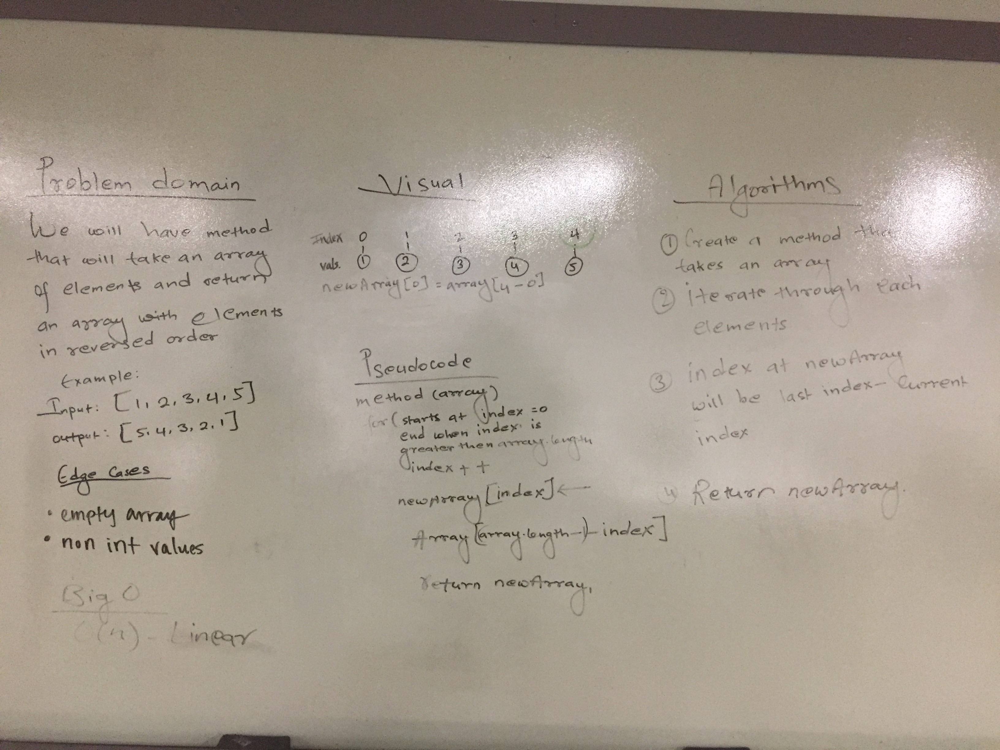
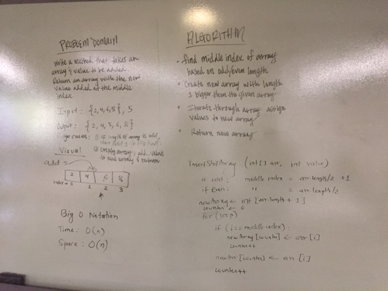

# code401challenge

## Table of Contents
1. Reverse an Array
2. Insert and shift an array in middle at index

--------------------------------------------------------------

### 1. Reverse an Array

#### Challenge
Write a function called reverseArray which takes an array as an argument. Without utilizing any of the built-in methods available to your language, return an array with elements in reversed order.

#### Approach & Efficiency
The approach we took was to iterate through the array and during each iteration we would populate a new array with the correct reversed value.

```
newArray[i] = array[(array.length - 1) - i]
```

0(n) - linear runtime

#### Solution


--------------------------------------------------------------

### 2. Insert and shift an array in middle at index

#### Challenge
Write a function called insertShiftArray which takes in an array and the value to be added. Without utilizing any of the built-in methods available to your language, return an array with the new value added at the middle index.

#### Approach & Efficiency
The approach we took was iterating through the given array, assigning the value into our new array, and while doing that we kept track of the index with an outside counter variable.  This allowed us to increment the counter variable once we reached our midpoint without effecting our iterating through the given array.


Big O Notation
Time: O(n)
Space: O(n)

#### Solution
