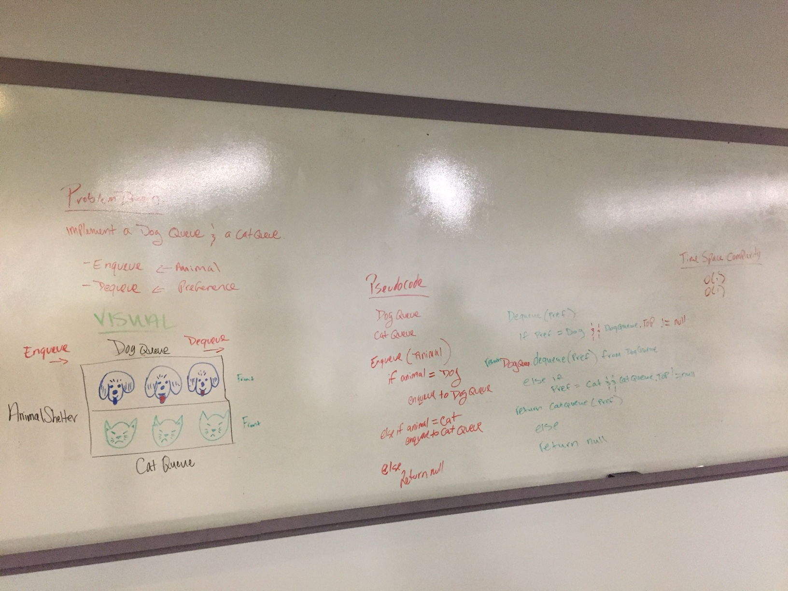

# code401challenge

## Table of Contents
1. Reverse an Array
2. Insert and shift an array in middle at index
3. Binary search in a sorted 1D array
4. Linked List Implementation
5. Linked list insertions
6. Stacks and queues
7. Animal Shelter
8. Multi-bracket Validation
9. Binary Tree and BST Implementation

--------------------------------------------------------------

### 1. Reverse an Array

#### Challenge
Write a function called reverseArray which takes an array as an argument. Without utilizing any of the built-in methods available to your language, return an array with elements in reversed order.

#### Approach & Efficiency
The approach we took was to iterate through the array and during each iteration we would populate a new array with the correct reversed value.

```
newArray[i] = array[(array.length - 1) - i]
```

0(n) - linear runtime

### Code
[Github](https://github.com/mattstuhring/data-structures-and-algorithms/blob/master/code401challenges/src/main/java/code401challenges/ArrayReverse.java)

### Contributions
- Sapana Poudel

#### Solution


--------------------------------------------------------------

### 2. Insert and shift an array in middle at index

#### Challenge
Write a function called insertShiftArray which takes in an array and the value to be added. Without utilizing any of the built-in methods available to your language, return an array with the new value added at the middle index.

#### Approach & Efficiency
The approach we took was iterating through the given array, assigning the value into our new array, and while doing that we kept track of the index with an outside counter variable.  This allowed us to increment the counter variable once we reached our midpoint without effecting our iterating through the given array.

Big O Notation
Time: O(n)
Space: O(n)

### Code
[Github](https://github.com/mattstuhring/data-structures-and-algorithms/blob/master/code401challenges/src/main/java/code401challenges/ArrayShift.java)

### Contributions
- Jack Kinne
- Manish KC

#### Solution


--------------------------------------------------------------

### 3. Binary search in a sorted 1D array

#### Challenge
Write a function called BinarySearch which takes in 2 parameters: a sorted array and the search key. Without utilizing any of the built-in methods available to your language, return the index of the array’s element that is equal to the search key, or -1 if the element does not exist.

#### Approach & Efficiency
As long as min is less than or equal to max a while loop will continue to check if the key is larger, smaller, or the same.  If the element does not exist the method will return -1;

Big O Notation
Time: O(log(n))
Space: O(1)

### Code
[Github](https://github.com/mattstuhring/data-structures-and-algorithms/blob/master/code401challenges/src/main/java/code401challenges/BinarySearch.java)

### Contributions
- Jack Kinne
- Brandon Hurrington
- Marisha Hoza
- Chris Coulon

#### Solution


--------------------------------------------------------------

### 4. Linked List Implementation

#### Challenge
Implement a Singly Linked List Data Structure

#### Approach & Efficiency
Create a Node class that has properties for the value stored in the Node, and a pointer to the next Node.  Within your LinkedList class, include a head property. Upon instantiation, an empty Linked List should be created.

Big O Notation
Time: O(n)
Space: O(1)

### Code
[Github](https://github.com/mattstuhring/data-structures-and-algorithms/blob/master/code401challenges/src/main/java/linkedList/LinkedList.java)

### Contributions
- Jack Kinne
- Melfi Perez
- Nic Paro
- Travis Cox

#### Solution
N/A

--------------------------------------------------------------

### 5. Linked list insertions

#### Challenge
Write 3 insertion methods for a singly linked list.

#### Approach & Efficiency
Continue working off of the already built LinkedList & Node class.  Implement 3 insertion methods to append a node at the end, insert before a node, and insert after a node.

Big O Notation
Time: O(n)
Space: O(1)

### Code
[Github](https://github.com/mattstuhring/data-structures-and-algorithms/blob/master/code401challenges/src/main/java/linkedList/LinkedList.java)

### Contributions
- Renee Messick

#### Solution


--------------------------------------------------------------

### 7. k-th value from the end of a linked list

#### Challenge
Write a method for the Linked List class which takes a number, k, as a parameter. Return the node’s value that is k from the end of the linked list. 

#### Approach & Efficiency
Traverse the entire linked list while keeping track of the length.  Iterate from 0 to the length of the linked list subtracting the k value.

Big O Notation
Time: O(n)
Space: O(1)

### Code
[Github](https://github.com/mattstuhring/data-structures-and-algorithms/blob/master/code401challenges/src/main/java/linkedList/LinkedList.java)

### Contributions
- Roman Gebrehiwot

#### Solution


--------------------------------------------------------------

### 8. Merge two linked lists

#### Challenge
Write a function called mergeLists which takes two linked lists as arguments. Zip the two linked lists together into one so that the nodes alternate between the two lists and return a reference to the head of the zipped list. Try and keep additional space down to O(1).

#### Approach & Efficiency
Traverse both linked list and do that until both point to null.  While traversing we are create a new linked list that points to the alterating nodes and always updating the next node for each linked list.  Once both linked list are pointing to null then we return the new linked list.

Big O Notation
Time: O(n)
Space: O(1)

### Code
[Github](https://github.com/mattstuhring/data-structures-and-algorithms/blob/master/code401challenges/src/main/java/linkedList/LinkedList.java)

### Contributions
- Jane Hur
- Nic Paro

#### Solution


--------------------------------------------------------------

### 9. Stacks and Queues

#### Challenge
Implement a Stack and a Queue Data Structure

#### Approach & Efficiency
Create a Node class that has properties for the value stored in the Node, and a pointer to the next node.  For the Stack class implement methods for push, pop, and peek.  For the Queue class implement mehtods for enqueue, dequeue, and peek.

Big O Notation
Time: O(1)
Space: O(1)

### Code
[Github](https://github.com/mattstuhring/data-structures-and-algorithms/blob/master/code401challenges/src/main/java/linkedList/LinkedList.java)

### Contributions
- Jack Kinne
- Melfi Perez
- Nic Paro
- Travis Cox
- Renee Messick

#### Solution
N/A

--------------------------------------------------------------

### 10. Stacks and Queues

#### Challenge
Implement a Queue using two Stacks

#### Approach & Efficiency
Create a brand new PseudoQueue class. Do not use an existing Queue. Instead, this PseudoQueue class will implement our standard queue interface (the two methods listed below), but will internally only utilize 2 Stack objects. Ensure that you create your class with the following methods: enqueue, dequeue

Big O Notation
Time: O(1)
Space: O(1)

### Code
[Github](https://github.com/mattstuhring/data-structures-and-algorithms/blob/master/code401challenges/src/main/java/stacksandqueues/PseudoQueue.java)

### Contributions
- Jack Kinne
- Melfi Perez
- Jane Hur
- Renee Messick

#### Solution


--------------------------------------------------------------

### 10. Animal Shelter

#### Challenge
Create a class called AnimalShelter which holds only dogs and cats. The shelter operates using a first-in, first-out approach.

Implement the following methods:
- enqueue(animal): adds animal to the shelter. animal can be either a dog or a cat object.
- dequeue(pref): returns either a dog or a cat. If pref is not "dog" or "cat" then return null.

#### Approach & Efficiency
Create two queue's one for the dogs and one for the cats.  Create the enqueue method that checks if the parameter is a dog/cat and equeue to the correct queue.  Create the dequeue method that checks the preference is a dog/cat and also check that the queue is not empty.

Big O Notation
Time: O(1)
Space: O(n)

### Code
[Github](https://github.com/mattstuhring/data-structures-and-algorithms/blob/master/code401challenges/src/main/java/utilities/AnimalShelter.java)

### Contributions
- Jack Kinne
- Melfi Perez
- Renee Messick

#### Solution


--------------------------------------------------------------

### 11. Multi-bracket Validation

#### Challenge
Your function should take a string as its only argument, and should return a boolean representing whether or not the brackets in the string are balanced. There are 3 types of brackets:

- Round Brackets : ()
- Square Brackets : []
- Curly Brackets : {}

#### Approach & Efficiency
Create two queue's one for the dogs and one for the cats.  Create the enqueue method that checks if the parameter is a dog/cat and equeue to the correct queue.  Create the dequeue method that checks the preference is a dog/cat and also check that the queue is not empty.

Big O Notation
Time: O(n)
Space: O(n)

### Code
[Github](https://github.com/mattstuhring/data-structures-and-algorithms/blob/master/code401challenges/src/main/java/utilities/MultiBracketValidation.java)

### Contributions
N/A

#### Solution


--------------------------------------------------------------

### 15. Binary Tree and BST Implementation

#### Challenge
Create a Node class that has properties for the value stored in the node, the left child node, and the right child node.
Create a BinaryTree class
Define a method for each of the depth first traversals called preOrder, inOrder, and postOrder which returns an array of the values, ordered appropriately.

Create a BinarySearchTree class
Define a method named add that accepts a value, and adds a new node with that value in the correct location in the binary search tree.
Define a method named contains that accepts a value, and returns a boolean indicating whether or not the value is in the tree at least once.

#### Approach & Efficiency
Implement a tree by following instructions.

### Code
[Github](https://github.com/mattstuhring/data-structures-and-algorithms/blob/master/code401challenges/src/main/java/tree/BinarySearchTree.java)

### Contributions
- Jack Kinne
- Melfi Perez
- Renee Messick
- Travis Cox
- Nic Paro

### Resources
- https://www.youtube.com/watch?v=OgJL8eh87PI
- https://www.baeldung.com/java-binary-tree

#### Solution
N/A

