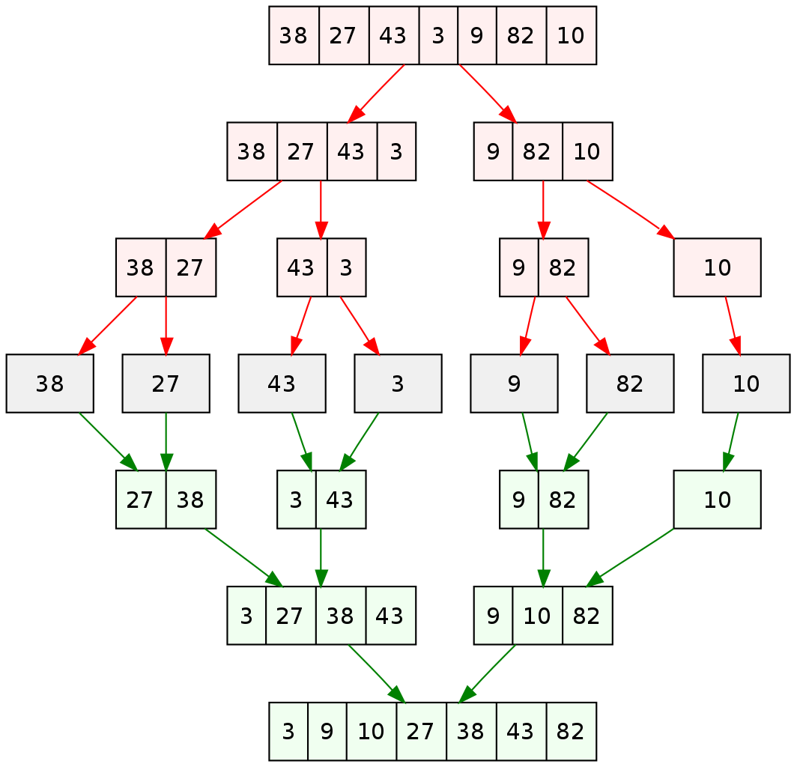

# BLOG Notes: Merge Sort

Brief description of what this algorithm is, does, and why we care.

- Merge sort is a divide-and-conquer algorithm based on the idea of breaking down a list into several sub-lists until each sublist consists of a single element and merging those sublists in a manner that results into a sorted list.

Is it more efficient than others? How does it attack the problem differently?

- Worst-case time complexity is Ο(n log n).


## Learning Objectives
- To be able to explain and implement merge sort.

## Diagram



## Algorithm
- if there is only one element in the array then it's already sorted, return.
- divide the array recursively into two halves until it can not be divided anymore.
- merge the smaller arrays into new array in sorted order.


## Pseudocode
```
ALGORITHM Mergesort(arr)
    DECLARE n <-- arr.length
           
    if n > 1
      DECLARE mid <-- n/2
      DECLARE left <-- arr[0...mid]
      DECLARE right <-- arr[mid...n]
      // sort the left side
      Mergesort(left)
      // sort the right side
      Mergesort(right)
      // merge the sorted left and right sides together
      Merge(left, right, arr)

ALGORITHM Merge(left, right, arr)
    DECLARE i <-- 0
    DECLARE j <-- 0
    DECLARE k <-- 0

    while i < left.length && j < right.length
        if left[i] <= right[j]
            arr[k] <-- left[i]
            i <-- i + 1
        else
            arr[k] <-- right[j]
            j <-- j + 1
            
        k <-- k + 1

    if i = left.length
       set remaining entries in arr to remaining values in right
    else
       set remaining entries in arr to remaining values in left
```

## Readings and References

Watch
- [YouTube - Merge Sort](https://www.youtube.com/watch?v=4VqmGXwpLqc)

Read
- [Tutorials Point - Merge Sort](https://www.tutorialspoint.com/data_structures_algorithms/merge_sort_algorithm.htm)
