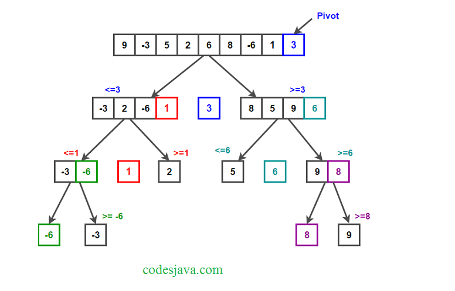

# BLOG Notes: Quick Sort

Brief description of what this algorithm is, does, and why we care.

- Divide and conquer
- Quick sort is a highly efficient sorting algorithm and is based on partitioning of array of data into smaller arrays. A large array is partitioned into two arrays one of which holds values smaller than the specified value, say pivot, based on which the partition is made and another array holds values greater than the pivot value.
- Partitioned in place, does not need a lot memory (Good!)

Is it more efficient than others? How does it attack the problem differently?

- The algorithm is quite efficient for large-sized data sets as its average and worst case complexity are of Ο(n2), where n is the number of items.


## Learning Objectives
- To be able to explain and implement quick sort.

## Diagram



## Algorithm
- Choose the highest index value has pivot
- Take two variables to point left and right of the list excluding pivot
- left points to the low index
- right points to the high
- while value at left is less than pivot move right
- while value at right is greater than pivot move left
- if both step 5 and step 6 does not match swap left and right
- if left ≥ right, the point where they met is new pivot


## Pseudocode
```
ALGORITHM QuickSort(arr, left, right)
    if left < right
        // Partition the array by setting the position of the pivot value 
        DEFINE position <-- Partition(arr, left, right)
        // Sort the left
        QuickSort(arr, left, position - 1)
        // Sort the right
        QuickSort(arr, position + 1, right)

ALGORITHM Partition(arr, left, right)
    // set a pivot value as a point of reference
    DEFINE pivot <-- arr[right]
    // create a variable to track the largest index of numbers lower than the defined pivot
    DEFINE low <-- left - 1
    for i <- left to right do
        if arr[i] <= pivot
            low++
            Swap(arr, i, low)

     // place the value of the pivot location in the middle.
     // all numbers smaller than the pivot are on the left, larger on the right. 
     Swap(arr, right, low + 1)
    // return the pivot index point
     return low + 1

ALGORITHM Swap(arr, i, low)
    DEFINE temp;
    temp <-- arr[i]
    arr[i] <-- arr[low]
    arr[low] <-- temp
```

## Readings and References

Watch
- [YouTube - Quick Sort](https://www.youtube.com/watch?v=Hoixgm4-P4M)

Read
- [Tutorials Point - Quick Sort](https://www.tutorialspoint.com/data_structures_algorithms/quick_sort_algorithm.htm)
